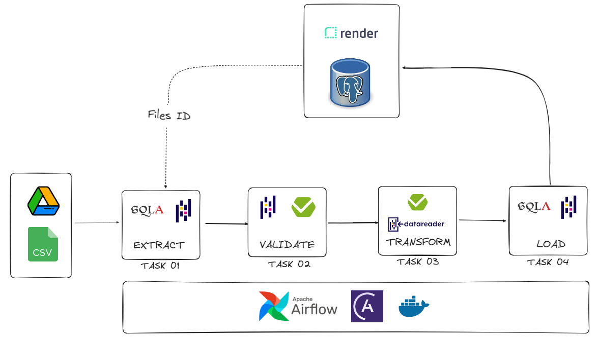
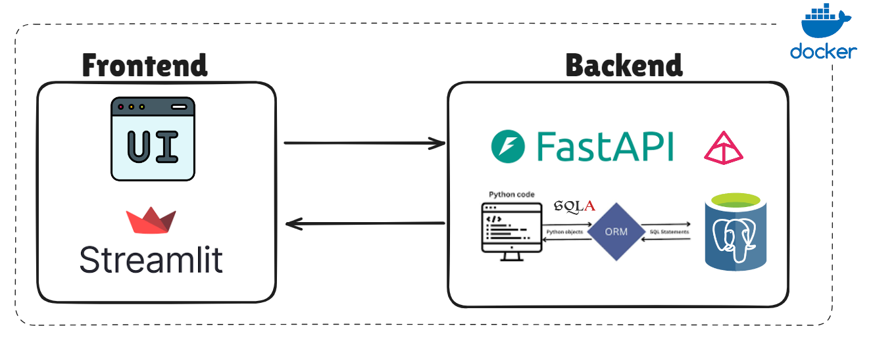
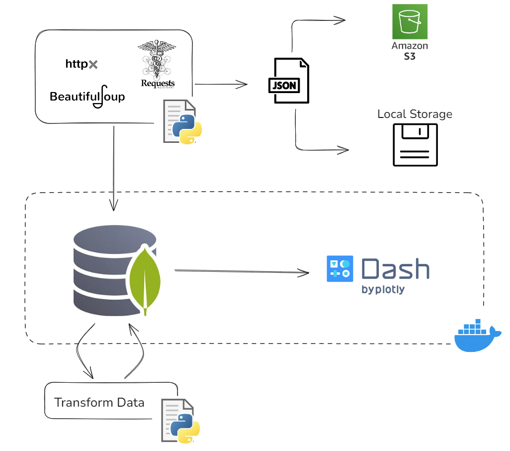

# Hello! I'm Renan :wave:

Welcome to my portfolio repository!

Here, I showcase all my public projects. Feel free to explore and get in touch if you have any questions. 

You can reach out to me using the links below:

<!-- 

  

 -->

## Table of contents

### Python

1. [Backend API for a digital book collection with JWT authentication using FastAPI](#backend-api-for-a-digital-book-collection-with-jwt-authentication-using-fastapi) 
2. [Orchestrating an ETL with Airflow - From Google Drive to PostgreSQL](#orchestrating-an-etl-with-airflow---from-google-drive-to-postgresql)
3. [Rental Properties CRUD Catalog with SQLAlchemy, FastAPI, Streamlit and AWS Deploy](#rental-properties-crud-catalog-with-sqlalchemy-fastapi-streamlit-and-aws-deploy) 
4. [Property Sales Dashboard Using Real Data Crawled from Real Estate Website - Httpx, MongoDB and Dash-plotly](#property-sales-dashboard-using-real-data-crawled-from-real-estate-website---httpx-mongodb-and-dash-plotly)
5. [Excel Schema Validator with Pydantic and Streamlit](#excel-schema-validator-with-pydantic-and-streamlit)

## SQL
1. [Analytic Report with SQL - Northwind database](#analytic-report-with-sql---northwind-database)
2. [Automating Northwind database operations using PL/pgSQL - Stored Procedures and Triggers](#automating-northwind-database-operations-using-plpgsql---stored-procedures-and-triggers)

-------------------------------------------------------------------------------

## Backend API for a digital book collection with JWT authentication using FastAPI

This project consists of a backend API developed using [FastAPI](https://fastapi.tiangolo.com/) for a simplified version of a digital book collection.

It's called MADR (Mader), a Portuguese acronym for "Meu Acervo Digital de Romances" (My Digital Collection of Romances), and it allows user registration and all CRUD operations for both authors and books.

It is built using the FastAPI framework, with [Pydantic](https://docs.pydantic.dev/latest/) responsible for data validation. It uses a PostgreSQL database, and [SQLAlchemy](https://www.sqlalchemy.org/) is used for ORM, with [Alembic](https://alembic.sqlalchemy.org/en/latest/) handling database migrations during the development process.

JWT (JSON Web Token) is used as a Bearer token for authorization and authentication in API operations, such as creating, updating, and deleting records. The JWT is included in the Authorization header of HTTP requests as a Bearer token.

The tests have 100% coverage in the `src` folder using [pytest](https://docs.pytest.org/en/stable/) and [pytest-cov](https://pytest-cov.readthedocs.io/en/latest/). It also uses [factory-boy](https://factoryboy.readthedocs.io/en/stable/) to handle massive creation of models, [freezegun](https://github.com/spulec/freezegun) to test token expiration, and [testcontainers](https://testcontainers.com/guides/getting-started-with-testcontainers-for-python/) to build a PostgreSQL instance during tests.

It is possible to run it locally using Docker Compose, which creates all the tables in PostgreSQL. A CI routine was also implemented using GitHub Actions.

### Tools used

    
    
     
    
    
     
          
          

### How it works
The API has 4 main routes:

The `/auth` route is used for user login and generates the access token responsible for authorizing and authenticating some of the CRUD operations. It is also possible to refresh the token, which is set to last 60 minutes by default.

The `/user` route is used to create a user and manage the account. 

The `/book` route is responsible for the CRUD operations related to books.

The `/author` route is responsible for the CRUD operations related to authors.

See the full project repository [here](https://github.com/lealre/madr-fastapi).

---------------------------------------------------------------------------------------------------

## Orchestrating an ETL with Airflow - From Google Drive to PostgreSQL

An ETL orchestration using Airflow, extracting CSV files from a folder in Google Drive, transforming values, and storing them in a PostgreSQL database.

The data is handled in a pandas DataFrame format, and all the data validation is performed using the Pandera library, a Pydantic-based library to validate DataFrame schemas. By setting a specific data contract, validations occur in two phases: when extracted and when transformed.

The Airflow implementation was created using the Astro CLI, the command line interface for data orchestration from Astronomer.

### Tools used

         
    
    
    
    
          
    
          
          

### How it works

Task 01: Connect with Google Drive API and extract CSV files

Task 02: Validate extracted data

Task 03: Transform data and validate it

Task 04: Load data in database

See the full project repository [here](https://github.com/lealre/etl-airflow?tab=readme-ov-file).

-------------------------------------------------------------------------------
## Rental Properties CRUD Catalog with SQLAlchemy, FastAPI, Streamlit and AWS Deploy

Web application for performing asynchronous CRUD operations on a PostgreSQL database using FastAPI, SQLAlchemy, Pydantic, Streamlit, and Docker.

### Tools used

              
    
         
    
    
    
          
    

          
### How it works

The project was built in a way where three services communicate with each other separately: database, backend, and frontend. Docker Compose was used to orchestrate the containers, allowing the frontend to communicate with the backend through the API once each one is running in independent containers.

In each of these operations, the frontend sends a request to the API created using FastAPI. The API is responsible for communicating with the backend and sending a response back to the frontend to display the result of the CRUD operation. In the first layer, Pydantic is used to validate all the inputs, ensuring that the schema the user is trying to send matches the database table schema. If it doesn't match, an error message is displayed to the user.

After [Pydantic](https://docs.pydantic.dev/latest/) validation is completed, [SQLAlchemy](https://www.sqlalchemy.org/) is used to communicate with PostgreSQL and perform one of the CRUD operations in the database.

[Alembic](https://alembic.sqlalchemy.org/en/latest/) was also used to perform database migrations, and [Pytest](https://docs.pytest.org/en/stable/) was used to perform some basic tests on asynchronous backend routes.

See the full project repository [here](https://github.com/lealre/crud-rental-properties).

-------------------------------------------------------------------------------

## Property Sales Dashboard Using Real Data Crawled from Real Estate Website - Httpx, MongoDB and Dash-plotly

This repository consists of an implementation of a dashboard containing data scraped from a real estate website: [Imovirtual](https://www.imovirtual.com/), a Portuguese real estate website offering homes, apartments, and other properties for sale and rent. 

Using MongoDB as the database, it crawls raw data, cleans it, and makes it ready to be used in the dashboard.

### Tools used

   
     
    
    
    
    

          
### How it works

The project is divided into two blocks that can work separately:

- **Data Ingestion** 

Responsible for crawling the data, consolidating it in the database while avoiding duplicates, and preparing the data for use in the dashboard. 

The raw collection, which comes from the crawler, can store data in MongoDB, an AWS S3 bucket as a JSON file, or locally as a JSON file, depending on the settings in the .env file.

For the data used in the dashboard, a new collection is created. This pipeline extracts data from one of the previous collections (raw or consolidated), filters and transforms it so that it is ready for use in the dashboard.

For this specific website, it was possible to use asynchronous requests.

- **Dashboard**

Uses the cleaned and filtered data from the database.

See the full project repository [here](https://github.com/lealre/crawler-to-dash).

---------------------------------------------------------------------------------------------------

## Excel Schema Validator with Pydantic and Streamlit

Web application that validates a specific Excel schema and stores the data in a PostgreSQL database. The predefined schema is the contract schema, and the application validates it from Excel files using Pydantic, a Python validation library.

### Tools used

       
         
    
    
    
    
          
              

### How it works

The user can upload Excel files in the app, and if the schema differs from the contract, the application will display a message indicating where the data schema differs from the contract schema, highlighting the specific rows and columns where the data does not conform to the agreed-upon schema.

If the schema from the uploaded file passes validation, the app gives the option to store the data in the database

See the full project repository [here](https://github.com/lealre/excel-schema-validator).

---------------------------------------------------------------------------------------------------

## Analytic Report with SQL - Northwind database

This project aims to generate an analytical business report from a database that contains sales data from a company called Northwind Traders, which imports and exports specialty foods from around the world. 

It focus primarily on extracting insights from revenue, product, and customer data using SQL operations in a PostgreSQL database.

It is possible to run this project using only Docker, as it builds both the PostgreSQL database and the client pgAdmin. All instructions are provided in How to run this project section.

See the full project repository [here](https://github.com/lealre/northwind-analytics-sql).

---------------------------------------------------------------------------------------------------

## Automating Northwind database operations using PL/pgSQL - Stored Procedures and Triggers

This project aims to use stored procedures and triggers in SQL to automate operations in a database.

By using the PL/pgSQL language on a PostgreSQL database server, two automations were implemented: the first to automatically register changes in an employee's title in a secondary table for future audits; the second to check if there is sufficient stock to fulfill a new order when it is added, as well as updating the stock quantity after the order is stored.

It is possible to run this project using only Docker, as it builds both the PostgreSQL database and the client pgAdmin. All instructions are provided in How to run this project section.

See the full project repository [here](https://github.com/lealre/northwind-PLpgSQL).
