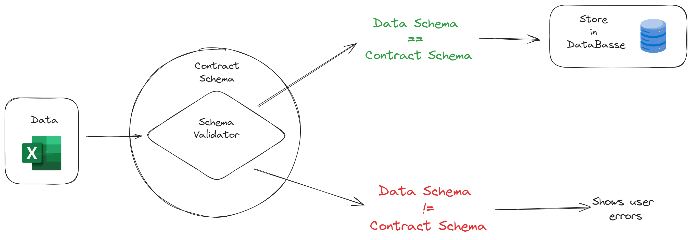

# Hello! I'm Renan

Description Here

    
    

Below you can found all my projects

### Table of contents

1. [Rental Properties CRUD Catalog with SQLAlchemy, FastAPI, Streamlit and AWS Deploy](#rental-properties-crud-catalog-with-sqlalchemy-fastapi-streamlit-and-aws-deploy) 
2. [Orchestrating an ETL with Airflow - From Google Drive to PostgreSQL](#orchestrating-an-etl-with-airflow---from-google-drive-to-postgresql)
3. [Excel Schema Validator with Pydantic and Streamlit](#excel-schema-validator-with-pydantic-and-streamlit)

# Rental Properties CRUD Catalog with SQLAlchemy, FastAPI, Streamlit and AWS Deploy

A web application for performing CRUD operations (Create, Read, Update and Delete) of rental properties stored in a PostgreSQL database.

### Tools used

              
    
         
    
    
    
          
    

          
### How it works

The project was built in a way where three services communicate with each other separately: database, backend, and frontend. Docker Compose was used to orchestrate the containers, allowing the frontend to communicate with the backend through the API once each one is running in independent containers.

In each of the CRUD operations, the frontend sends a request to the API created using FastAPI. The API is responsible for communicating with the backend and sending a response back to the frontend to display the result of the CRUD operation. In the first layer, Pydantic is used to validate all the inputs, ensuring that the schema the user is trying to send matches the database table schema. If it doesn't match, an error message is displayed to the user.

After Pydantic validation is completed, SQLAlchemy is used to communicate with PostgreSQL and perform one of the CRUD operations in the database

See the full project repository [here](https://github.com/lealre/crud-rental-properties).

---------------------------------------------------------------------------------------------------

# Orchestrating an ETL with Airflow - From Google Drive to PostgreSQL

An ETL orchestration using Airflow, extracting CSV files from a folder in Google Drive, transforming values, and storing them in a PostgreSQL database.

The data is handled in a pandas DataFrame format, and all the data validation is performed using the Pandera library, a Pydantic-based library to validate DataFrame schemas. By setting a specific data contract, validations occur in two phases: when extracted and when transformed.

The Airflow implementation was created using the Astro CLI, the command line interface for data orchestration from Astronomer.

### Tools used

         
    
    
    
    
          
    
          
          

### How it works

Task 01: Connect with Google Drive API and extract CSV files

Task 02: Validate extracted data

Task 03: Transform data and validate it

Task 04: Load data in database

See the full project repository [here](https://github.com/lealre/etl-airflow?tab=readme-ov-file).

---------------------------------------------------------------------------------------------------

# Excel Schema Validator with Pydantic and Streamlit

Web application that validates a specific Excel schema and stores the data in a PostgreSQL database. The predefined schema is the contract schema, and the application validates it from Excel files using Pydantic, a Python validation library.

### Tools used

       
         
    
    
    
    
          
              

### How it works

The user can upload Excel files in the app, and if the schema differs from the contract, the application will display a message indicating where the data schema differs from the contract schema, highlighting the specific rows and columns where the data does not conform to the agreed-upon schema.

If the schema from the uploaded file passes validation, the app gives the option to store the data in the database

See the full project repository [here](https://github.com/lealre/etl-airflow?tab=readme-ov-file).

